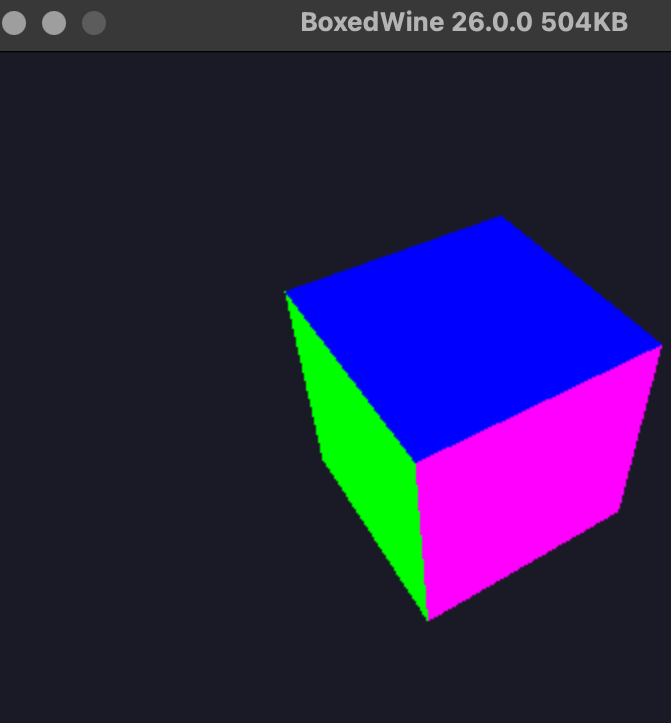
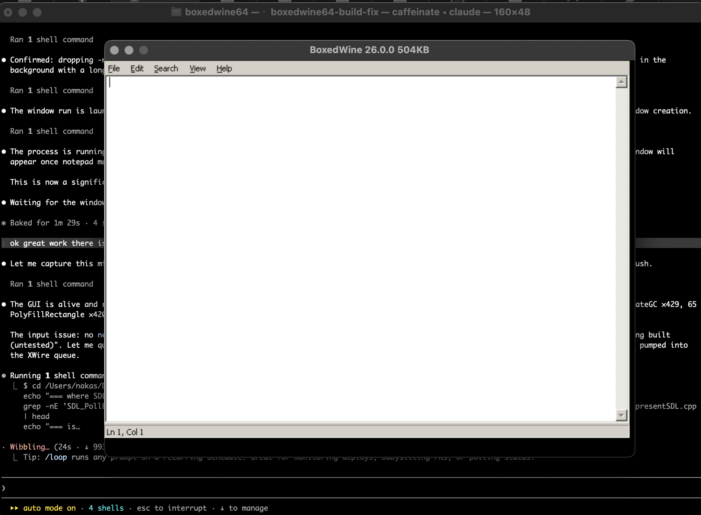

# Boxedwine64

**Boxedwine64** is a fork of [Boxedwine](https://github.com/danoon2/Boxedwine) that adds x86\_64 guest support so it can run 64-bit Wine (`wine64`) and 64-bit Linux ELF binaries. Boxedwine itself is a userland emulator: it implements an x86 CPU and a fake Linux kernel, then runs Wine on top of that so Windows applications execute without a real Linux host.

This fork is a **work in progress**, but a substantial one: real Debian `wine64` boots Windows programs all the way to a **visible, rendered GUI window** — both natively on macOS arm64 and **in a browser tab via WebAssembly** (`-sMEMORY64` + Web Workers/`SharedArrayBuffer`). That includes a **hardware-accelerated OpenGL 3D app (a spinning, shaded cube via WGL → host GL / WebGL2)** and interactive `notepad.exe` (File ▸ Save As, plus a "download my files" button in the browser), driving real `wineserver64`, `winex11`, FreeType/fontconfig text, and an in-process X11 wire server. The 32-bit code path remains fully functional and unchanged. The 64-bit code path is gated behind `BOXEDWINE_GUEST_X64` and was built out entirely by running real binaries and implementing each opcode/syscall they touch.

> ### ▶ [**Try the live demo: real `wine64` in your browser**](https://andrewnakas.github.io/Boxedwine64/)
>
> Open <https://andrewnakas.github.io/Boxedwine64/> in a recent Chrome/Edge/Safari. After the one-time rootfs download, use the **app bar** at the top to switch between the **spinning OpenGL cube** (`glcube`), interactive **Notepad/WordPad**, **Minesweeper**, **Snake/Tetris**, and a playable **DOOM** — or **bring your own** Windows `.exe` with the *"⬆ Run my own .exe"* button (see [App compatibility](#app-compatibility-in-browser-wasm64-mt) for what fits). A **persistent in-browser `wineserver64`** stays resident, so launching an app **spawns it into the SAME running wine** — no page reload, the prefix and GL context stay warm between apps (this is the "load a new app into the same wine" item that was long on the roadmap; `?session=0` falls back to reload-per-app). First load is ~196 MB and takes a minute; give the cube ~20–30 s to boot.



*Real `wine64 glcube.exe` running under Boxedwine64 on macOS arm64 — a Win32
WGL/OpenGL program drawing a depth-tested, Gouraud-shaded 3D cube. The guest's
`opengl32.dll` calls flow through wine's GL stack, are translated by Boxedwine to
the host's Metal-backed OpenGL, and the framebuffer is presented in a live SDL
window. This is the whole pipeline — window creation, the Win32 message pump,
`wglCreateContext`/`wglMakeCurrent`, per-frame GL command translation, and
`SwapBuffers` — running end to end in the 64-bit emulator.*



*Real `wine64 notepad.exe` running under Boxedwine64 on macOS arm64 — full menu bar, FreeType-rendered text, scrollbar, status bar, and a live caret, painted through the in-process X11 wire server.*

> Boxedwine is released under the GNU General Public License v2 (GPL). Original upstream by danoon2 — see [github.com/danoon2/Boxedwine](https://github.com/danoon2/Boxedwine).

---

## Current state (June 2026)

**`wine64 notepad.exe` now runs as a real, interactive GUI app on macOS arm64 —
including File ▸ Save As all the way to a file on disk.** The full Windows-PE +
X11 path is up: real Debian `wine64` boots the entire `wineboot → services.exe →
winex11` chain, connects to an in-process X11 wire server, and **paints a live
notepad window** (hundreds of `PutImage`/GDI draw requests per frame,
FreeType-rendered text, an animated caret). The `wine64`↔`wineserver` IPC
handshake, the NT-syscall dispatch, real PE image loading, and the X11 wire
protocol all work end to end. **Keyboard and mouse input work**: you can type
into notepad, click to place the caret, open the menus (composited as separate
top-level windows), and the host shows wine's own cursor (I-beam over text,
arrow elsewhere) aligned to the pointer.

**The common-dialog round trip works**: opening Save As pops the modal dialog as
its own top-level window, you can type a filename, **click its buttons** (pointer
events hit-test to the topmost window under the cursor, so clicks land on the
dialog and not the window behind it), and the file is written through wine's
`C:` drive to the host filesystem (`tools/rootfs64/root/home/username/`).

**3D / OpenGL now works** (`wine64 glcube.exe` renders a spinning shaded cube),
which required closing two bugs that previously made any idling/3D app a "boot
lottery":

- A connected-socket teardown could make a 64-bit client's write to its
  wineserver request socket return the internal `-K_CONTINUE` sentinel (from the
  SIGPIPE path, which is mis-delivered on a 64-bit thread), which wine read as a
  short "partial write" and turned into a fatal client error + wineserver heap
  corruption. A broken-pipe write on a 64-bit thread now returns a clean
  `-EPIPE`, exactly as Linux does when `SIGPIPE` is ignored (wine always ignores
  it).
- `sched_yield` set the per-CPU `yield` flag, which the multi-threaded run loop
  interprets as "this thread has exited" — so **every guest `sched_yield`
  silently destroyed the calling thread**. wine's `Sleep()`/message-pump
  short-wait spins on `sched_yield`, so any app that idled lost its main thread
  and hung. `sched_yield` no longer sets that flag in the multi-threaded build
  (it just relinquishes the host CPU), so the message pump runs and 3D apps
  reach their render loop.

Boots now reach a painted window in **~25 s** rather than appearing to hang for
minutes: a per-CPU instruction-fetch page cache removed a per-byte
mutex+hashmap lookup that was pinning a core inside wineserver's name-table
scans. Pick any bundled Windows program to launch with the
**`tools/run_wine64_gui.sh`** picker (notepad, winecfg, regedit, taskmgr, clock,
write, …) — the 64-bit equivalent of the 32-bit "run a program" UI.

Headless, the same stack runs `wine64 wineboot --init` through **~4000 syscalls
across the full process tree** (client, `wineserver64`, `services.exe`,
`winex11`, …) with **zero unimplemented syscalls and no heap corruption**,
populating a real win64 prefix.

The 64-bit guest path can:

- Decode and execute a large fraction of the x86\_64 user-mode ISA (general-purpose, SSE2 packed + scalar FP, most of x87, CMOV, multi-byte NOP, XGETBV, RDTSCP, BT family, REP string ops, PSHUFB, PALIGNR, segment-register MOV, atomic RMW: XCHG/CMPXCHG/XADD/LOCK-prefixed ALU)
- Load and run **real dynamically-linked glibc 2.36 ELF64 binaries** from a 64-bit rootfs — full PT\_DYNAMIC walk, versioned-symbol (Verneed) resolution across multiple DSOs, lazy PLT/GOT resolution, IFUNC, TLS
- Run **real x86\_64 threads**: `clone`/`clone3`, real `futex` WAIT/WAKE, per-thread CPU state, `pthread_create`/`pthread_join` — each guest thread on its own host thread, with sharded per-address atomic locks so glibc mutexes are correct under contention
- **Real `fork()`** (non-thread `clone` → new process with a deep-copied address space) + **64-bit `execve`** + **`wait4`** reaping — the basis for `wine64` spawning `wineserver`
- A full **AF\_UNIX socket + epoll IPC surface**: `socket`/`socketpair`/`bind`/`connect`/`listen`/`accept`/`shutdown`/`setsockopt`, `epoll_create`/`ctl`/`wait`, `pipe`/`pipe2`, and **`sendmsg`/`recvmsg` with full 64-bit `msghdr`/`iovec`/`cmsghdr` marshaling and `SCM_RIGHTS` fd-passing** (the wineserver request/reply protocol)
- Dispatch 90+ syscalls total (the above plus write/read/open/openat/close/stat/fstat/newfstatat/mmap/mprotect/munmap/brk/dup/fcntl/chdir/fchdir/mkdir/symlink/unlink/pread64/pwrite64/ftruncate/getdents64/rt\_sig\*/sigaltstack/sched\_get\|setaffinity/exit\_group/arch\_prctl/uname/getrandom/prlimit64/set\_tid\_address/umask/setsid/…)
- Run the 64-bit self-test harness — **234/234 PASS**

### What works end-to-end

- **`wine64 glcube.exe`** → a real **OpenGL 3D app**: boots the full GUI chain,
  creates a WGL context, and **renders a spinning, Gouraud-shaded cube** through
  wine's GL stack onto the host's Metal-backed OpenGL, presented in a live SDL
  window. This exercises the complete path — message pump, `wglCreateContext`/
  `wglMakeCurrent`, GL command translation, and `SwapBuffers` — not just 2D GDI.
  Launch with `tools/run_wine64_gui.sh 'C:\glcube.exe'`.
- **`wine64 notepad.exe`** → boots the full `wineboot → services.exe → winex11`
  chain and **renders a visible notepad window** on macOS: real PE image
  loading, NT-syscall dispatch, an in-process X11 wire server, FreeType +
  fontconfig text, and the GDI draw path (`CreateGC`/`PolyFillRectangle`/
  `CopyArea`/`PutImage`). Run **without** `-novideo` to get the host window.
- **`wine64 --version`** → `wine-8.0 (Debian 8.0~repack-4)`, exit 0, headless
- **`wine64 wineboot --init`** → forks `wineserver64`; wineserver binds/listens
  its socket, accepts the client, loads NLS locales, creates and **populates** a
  real win64 registry/prefix, runs its epoll main loop; all processes exit
  cleanly with no heap corruption.
- **Dynamic glibc programs from a 64-bit rootfs**: `hello_glibc`, busybox `ls -la /` (dynamic `getdents64`), GNU `ls` across 3 versioned DSOs
- **Threading probes**: `clone`+futex join, a 4-thread atomic/mutex probe (`mt_probe`), `pthread_join` wakeup — all deterministic PASS
- The static-PIE smoke suite (`tools/x64test/run-static-elf-suite.sh`) — **7/7 PASS** on `zig cc`-built musl binaries (hello, sum, sieve, fib25, qsort, strops, hash)
- The in-tree end-to-end PLT self-test: loads a separate shared library, resolves `R_X86_64_JUMP_SLOT` against an exported function, calls through the GOT to return 42
- **Interactive GUI input**: type into notepad, click to place/move the caret,
  open and track the menus, and see wine's own cursor aligned to the pointer —
  SDL key/mouse events are translated to X11 input events, pointer/focus/grab
  requests are answered, popup menus are composited as overlay windows, and
  click coordinates are translated through the window's root origin
- **Common-dialog Save As**: type a filename, click the dialog's buttons, and
  write the file out to the host. Backed by SysV shared memory
  (`shmget`/`shmat`/`shmctl`/`shmdt` for wine's view-backing), MAP_FIXED-correct
  anonymous `mmap` placement (a bare hint relocates instead of stomping a wine
  view → no more `create_view` abort), and multi-window pointer hit-testing so a
  modal dialog over the main window still receives its clicks
- **`tools/run_wine64_gui.sh`** picker: launch any bundled GUI program (notepad,
  winecfg, regedit, taskmgr, clock, write, explorer, …) in a real window, by
  menu or by name — the 64-bit analogue of the 32-bit "run a program" UI

### What does not work yet

- **No 64-bit JIT** — interpreter only (by design; v1 ships interpreter-only)
- **No lazy/streamable rootfs in the browser yet** — the WASM build mounts the
  full `wine64.zip` (~196 MB) up front, so first boot is slow (~2.5 min). The core
  itself runs under `-sMEMORY64` and renders GUIs in a tab — see
  [WebAssembly / browser](#webassembly-and-the-browser) below.
- **X core-font text** (`PolyText8`/`PolyText16`) is unimplemented, so control/
  dialog text drawn through X core fonts doesn't paint yet (notepad's main edit
  area paints fine via GDI → `PutImage`)

---

## Graphics: 2D GDI and 3D OpenGL

Boxedwine64 has **two complementary rendering paths**, and both now work end to
end on macOS arm64. Neither needs a real X server, a real Linux host, or any
Windows DLLs from Microsoft — it's stock Debian `wine64` driving Boxedwine's
emulated kernel and an in-process display server.

### The display stack

Windows GUI apps under wine talk to `winex11.drv`, which speaks the **X11 wire
protocol** over a socket to an X server. There is no X server on macOS, so
Boxedwine64 ships an **in-process X11 wire server** (`source/x11wire/`): it
accepts winex11's connection, answers the handshake, and implements the X
requests wine actually issues — `CreateWindow`, `MapWindow`, `CreateGC`,
`ConfigureWindow`, property/atom/selection requests, input grabs, and the
drawing requests. Output is presented through **SDL** to a native macOS window;
input (SDL key/mouse events) is translated back into X11 input events and
delivered to the guest. The result is a real, movable, clickable window with
wine's own cursor — no XQuartz, no host X server.

### 2D — GDI / framebuffer apps (notepad)

`notepad.exe` paints through the classic GDI path: wine rasterizes text and
controls (FreeType + fontconfig for glyphs) into a client-side bitmap and pushes
it to the window with `PutImage`/`CopyArea`/`PolyFillRectangle`/`CreateGC`. The
wire server blits those into the SDL framebuffer. Hundreds of these requests
flow per repaint; the window shows a live menu bar, scrollbar, status bar, and a
blinking caret. **Interactive input works**: typing reaches the edit control,
clicks place the caret, menus open as composited top-level windows, and the
Save As common dialog round-trips a file to the host filesystem.

### 3D — WGL / OpenGL apps (glcube)

The headline result: **a Win32 OpenGL program renders real 3D**. `glcube.exe`
is a plain WGL app — `ChoosePixelFormat`/`SetPixelFormat`,
`wglCreateContext`/`wglMakeCurrent`, then a render loop issuing classic OpenGL
(`glClear`, matrix setup, `glBegin`/`glVertex`/`glColor` for the cube faces,
`SwapBuffers`). The call chain is:

```
glcube.exe → opengl32.dll (wine) → Boxedwine GL translation → host OpenGL (Metal-backed on Apple GPUs) → SDL present
```

Boxedwine intercepts the guest's GL entry points and replays them against the
host's OpenGL context, so the cube is **actually drawn by the Mac GPU**, not
softrendered. Depth testing, per-vertex color interpolation (the blue/green/
magenta faces), the perspective projection, and continuous animation via
`SwapBuffers` all run from inside the emulated 64-bit process. Launch it with:

```sh
tools/run_wine64_gui.sh 'C:\glcube.exe'
```

### What it took to get here

3D and any idling/animated app were previously a **"boot lottery"** — they'd
intermittently die or hang before reaching their render loop. Two emulator bugs
were responsible, both now fixed:

- **Broken-pipe writes leaked an internal sentinel.** When a connected unix
  socket's peer was gone, a 64-bit client's write took wine's SIGPIPE path,
  which is mis-delivered on the unused 32-bit CPU for a 64-bit thread and
  returned the `-K_CONTINUE` restart sentinel. The 64-bit syscall dispatcher
  left that in `RAX` as a bogus byte count, so wine read a short **"partial
  write"** on its wineserver request socket → fatal client error + wineserver
  heap corruption. A 64-bit broken-pipe write now returns a clean **`-EPIPE`**,
  exactly as Linux does when `SIGPIPE` is ignored (wine always ignores it).
- **`sched_yield` destroyed the calling thread.** The 64-bit `sched_yield` set
  the per-CPU `yield` flag, which the multi-threaded run loop interprets as
  "this thread has finished" and tears the thread down. wine's `Sleep()` and the
  Win32 message pump spin on `sched_yield` while idling, so **every idling app
  silently lost its main thread and hung**. In the multi-threaded build
  `sched_yield` now only relinquishes the host CPU (`std::this_thread::yield`)
  and never signals thread exit, so the message pump runs and 3D apps reach —
  and stay in — their render loop.

With those fixed, `glcube.exe` renders the spinning cube, `notepad.exe` boots to
an interactive window, and the bare message-pump / sleep probes
(`tools/rootfs64/gltest/`) iterate cleanly. The 64-bit `--x64-selftest` stays at
**234/234**.

---

## Roadmap to a working Boxedwine64

This project drives the [`docs/PLAN_64BIT.md`](docs/PLAN_64BIT.md) §3.7–§3.10 roadmap toward "wine64 notepad.exe works on desktop and Chrome". The progression is iterative — every commit reflects one concrete opcode, syscall, or relocation discovered by running a real binary through `--x64-run-elf` and watching the decoder fail at the next unsupported byte sequence.

| Milestone | Goal | Status |
|---|---|---|
| **A — Dynamic linking** | PT\_DYNAMIC walk, R\_X86\_64\_\* relocations, DT\_NEEDED recursion, versioned symbols, PT\_TLS | ✅ Complete — real glibc + multi-DSO programs run from a 64-bit rootfs |
| **B — Threading + signals** | `clone`/`clone3`, real futex, `rt_sigaction`/`rt_sigreturn`, signal frames | ✅ Complete — `pthread_create`/`join`, per-thread CPU, sharded atomics |
| **C — Scalar FP + ISA gaps** | SSE2 scalar FP, x87 subset, BT family, XGETBV, RDTSCP, SSSE3, atomic RMW | ✅ Complete (229/229 selftest PASS) |
| **D — Rootfs + Wine64 build** | Build a real `wine64` rootfs (Docker), run it headless | ✅ Complete — `wine64 --version` → `wine-8.0`, headless |
| **E — fork/exec + wineserver IPC** | real `fork`/`execve`/`wait4`, AF\_UNIX sockets, epoll, `sendmsg`/`recvmsg` + SCM\_RIGHTS | ✅ Complete — `wineboot --init` drives the full wine64↔wineserver handshake |
| **F — Windows PE + GUI** | populate the prefix with Windows PE files, then the X server / GUI path; interactive input + a working common dialog | ✅ Complete — notepad paints, takes keyboard+mouse, and Save As writes a file to the host |
| **G — App breadth + X completeness** | get a spread of bundled apps (winecfg, regedit, clock, write, …) usable, fill the remaining X core opcodes they need | ⏳ Next |
| **H — Interpreter throughput** | close the gap to interactive speed: faster hot-path decode, fewer per-op map lookups, block/trace caching | 🟡 In progress — instruction-fetch page cache + profiled hot-opcode dispatch hoist landed (`BW64_OPPROF`); full decoded-block cache still open |
| **I — WASM memory64 + v1 polish** | Emscripten `-sMEMORY64`, Web Workers + SharedArrayBuffer threading, WebGL GL backend, lazy DLL fetch, browser tests — see [WebAssembly / browser](#webassembly-and-the-browser) | 🟢 Mostly there — self-tests pass headless in Node on `wasm32` and `-sMEMORY64` (234/234); the **multi-threaded browser build** (`make wasm64-mt`) **renders GUIs in a tab**: `glcube.exe` spins via the WebGL2 backend and `notepad.exe` is interactive (File ▸ Save As + a "download my files" button), verified in Chrome and Safari. Remaining: lazy/streamable rootfs (so the page doesn't pull ~196 MB up front), CI browser tests, and a couple of still-stubbed wineserver socket syscalls |

The commit log (`git log --oneline`) is the canonical, blow-by-blow record of the
bring-up — each commit names the opcode or syscall and the real binary that
uncovered it.

### Concrete next steps

The most useful work, in rough priority order:

1. **X core text — now the top gate (Milestone G).** Text-heavy apps (WordPad,
   and notepad once it reaches its text-draw) boot fully but then sit IDLE
   (~9% CPU, not spinning) at a flood of unhandled **`PolyText8`(65)/
   `PolyText16`(66)** requests — the window maps but never paints its text and
   the app blocks. This, not interpreter speed, is what currently stops those
   apps from being usable. Implement the X core-text path: `OpenFont`(45)/
   `QueryFont`(47, reply)/`PolyText8`(65)/`PolyText16`(66)/`ImageText8`(76) with
   a builtin fixed font + glyph blit into the window pixmap. Use
   `BW64_XWIREDUMP=1` to hex-dump the exact request layout. Then sweep the apps
   in `tools/run_wine64_gui.sh` (or `--wine-gui`) — `winecfg`, `regedit`,
   `clock` are the next highest-value targets.
2. **A real Save/Open into the Mac home.** Point the guest's
   `Documents`/`Desktop` `.link` files at a host-visible folder (or add a
   `-drive` mapping) so files land somewhere natural instead of inside the repo
   rootfs. Today everything under `C:` lives in `tools/rootfs64/root/`.
3. **Interpreter throughput (Milestone H, partly done).** The instruction-fetch
   page cache and the profiled hot-opcode dispatch hoist (`BW64_OPPROF`) landed;
   `step()` still re-decodes every instruction though. The remaining big lever is
   a per-RIP **decoded-block cache** (memoize prefix length + opcode class +
   instruction length, keyed by guest RIP, invalidated on unmap/exec) so the hot
   wineserver/GDI loops skip re-decode entirely — the path to "feels native."
4. **Reliability: kill the residual boot wedge.** Boots are fast now but still
   occasionally stall in wineserver's O(n) name-table scan. Either a wineserver-
   side fast path for the UTF-16 case-fold compare (disasm at `wineserver64`
   file-offset `0x663e0`/`0x302a0`) or the block cache above should clear it.
   Use `BW64_RIPSAMPLE=1` to confirm the spinner.
5. **Regression coverage.** Add a headless smoke test that boots `wineboot
   --init` + a non-interactive PE to a known exit, so the memory/mmap changes
   here can't silently regress. Keep `--x64-selftest` at 234/234.

---

## WebAssembly and the browser

`wine64` runs in a browser tab — no native app, no server round-trip. The same
`glcube.exe` (spinning 3D cube) and `notepad.exe` (interactive GUI, File ▸ Save As
to a downloadable file) that run on the desktop also run in Chrome/Safari on the
WASM build.

### Why 64-bit needs WASM Memory64

The 32-bit path fits a classic WASM linear memory (32-bit pointers in a ≤4 GB
`ArrayBuffer`). A 64-bit guest needs 64-bit pointers, which means **WebAssembly
Memory64** (`-sMEMORY64`). That's now shipping in current Chrome/Firefox. The one
fix that unblocked it: make `BOXEDWINE_64` track the real host pointer width
instead of `__WORDSIZE` (Emscripten's wasm64 keeps `__WORDSIZE==32` while pointers
are 8 bytes). The interpreter core had no other hidden 32-bit-host assumption —
`KMemory64` is already a software page table keyed on `U64` guest addresses, so
guest pointer width is independent of host pointer width.

### How it works in the browser

`make wasm64-mt` (in `project/emscripten`) builds the 64-bit core with
`BOXEDWINE_MULTI_THREADED -pthread -sPROXY_TO_PTHREAD -sMEMORY64`. The page maps
each piece of the desktop's host I/O surface onto a browser primitive:

| Desktop | Browser |
|---|---|
| host threads (`clone`/futex) | Web Workers + `SharedArrayBuffer` pthread pool |
| real sockets for wineserver IPC | in-memory socketpair/epoll shim (no real fds) |
| host OpenGL (Metal-backed) | WebGL2 on an HTML `<canvas>`, `SwapBuffers`→`requestAnimationFrame` |
| disk-mounted rootfs zips | `fetch()`ed into the Emscripten MEMFS, mounted by `FsZip` |

`wine64.html` + `wine64-launcher.js` are the launcher. It fetches the layered
64-bit zips (`glibc-rootfs64.zip`, `wine64.zip`, and a tiny pre-booted prefix
`prefix64.zip`), mounts them at `/`, and runs `wine64 <prog>` against the prefix so
the page skips `wineboot --init`. Cross-origin isolation (COOP/COEP) is **required**
for `SharedArrayBuffer` — serve via `node project/emscripten/server.mjs`, which
sets those headers.

The page has an **app bar** (glcube / Notepad) that does real **in-session
process spawning** — the "load a new app into the SAME running wine" item that was
long on the roadmap. The boot argv starts only a **long-lived foreground
`wineserver64 -f -p`** against the pre-booted prefix (`-f` = no fork, since the
in-emulator daemonize path is unreliable; `-p` = persist forever). Because the
emscripten main loop only quits when the last guest thread exits
(`platformThreadCount==0` → `SDL_QUIT`), that resident server keeps the whole
kernel — prefix, X11 wire server, GL context — **warm between apps**. Each app the
app bar requests is then spawned **into that running kernel** as `wine64 <app>`
via a tiny C bridge (`source/sdl/emscripten/wine64session.cpp`): the launcher's
`bw64_spawn()` (a `Module.ccall`) queues the launch behind a spinlock — non-
blocking, safe on the browser main thread where `Atomics.wait` is illegal — and
`mainloop()` drains the queue each tick, calling `KProcess::startProcess()` on the
main-loop thread. **No page reload, no module re-instantiation, no rootfs refetch,
and the previous app and the server keep running.** `?session=0` reverts to the
older reload-per-app path (navigate to `?p=<prog>`, fresh boot, rootfs served from
the immutable HTTP cache) — kept as a fallback since a true in-page *reboot* is
impossible (this build isn't `MODULARIZE`'d, so re-running `boxedwine64.js` throws
"duplicate variable", and the `#gl64canvas` `OffscreenCanvas` can't be transferred
to a pthread twice).

### App compatibility (in-browser, `wasm64-mt`)

What runs today in the browser build, why the sweet spot is shaped the way it is,
and how to bring your own app. The hard limits that decide feasibility: the x86-64
CPU is **interpreted (no JIT)** so CPU-bound code is ~10×+ slower; rendering only
works through the **GDI/USER32** path (`BitBlt`/`StretchDIBits`/`PutImage`) or the
basic **OpenGL→WebGL2** bridge — **no Direct3D/Direct2D/DirectWrite, no GPU
compute**; there is **no audio backend yet**; there is **no network** inside the
guest; and the whole rootfs is downloaded up front (no lazy loading), so **small
matters**. The bullseye is classic **Win32/GDI** apps — the 2000s–early-2010s
freeware era.

| App | Path | Status | Notes |
|---|---|---|---|
| **Notepad** | GDI/USER32 | ✅ Works | Interactive; File ▸ Save As writes a downloadable file |
| **WordPad** | GDI/USER32 | ✅ Works | Rich-edit control renders |
| **winecfg** | GDI/USER32 | ✅ Works | Wine's own config dialog |
| **winefile** | GDI/USER32 | ✅ Works | File manager |
| **Clock** | GDI/USER32 | ✅ Works | |
| **Minesweeper** (`winemine`) | GDI/USER32 | ✅ Works | |
| **Snake / Tetris** | GDI/USER32 | ✅ Works | Self-contained Win32, built with mingw-w64 (`tools/rootfs64/games`) |
| **glcube / gltri** | OpenGL → WebGL2 | ✅ Works | Spinning shaded cube via the `gl64` WGL→WebGL2 bridge |
| **DOOM** (`doomgeneric`) | GDI/USER32 | ✅ Playable | Shareware WAD; renders + keyboard/menu/movement work. Fire = **Ctrl / F / X** (browsers intercept Ctrl). No mouse/turn or sound yet |
| **Your own `.exe`** | depends on the app | ✅ via "Run my own .exe" | Drag in a **portable Win32/GDI** exe; see below |
| Task Mgr / regedit / control / explorer / IE / oleview | mixed | 🧪 Experimental | May not come up — depend on heavier shell/COM/X11 surface |
| .NET (WinForms) utilities | wine-mono + GDI+ | ⚠️ Poor fit | The CLR JITs IL at runtime — brutal under a non-JIT interpreter, plus a large wine-mono payload. WPF is Direct3D-backed → unsupported |
| System-info tools (CPU-Z, HWiNFO, Speccy…) | kernel driver + WMI | ❌ Won't run | No kernel driver / real hardware / WMI to read |
| Direct3D / GPU games & media players | D3D/DXVA | ❌ Unsupported | No D3D/Direct2D/DirectWrite backend |

**Run your own `.exe`** — the **"⬆ Run my own .exe"** toolbar button lets you pick
a Windows executable from your machine; it's written into the in-browser sandbox
(`Z:\home\username`) and launched in-session like any bundled app. This sidesteps
bundling/licensing (many useful utilities are free but not redistributable, so you
supply your own copy). Best results come from a **single, portable Win32/GDI exe**
— *not* installers, *not* apps that need sibling DLLs, *not* .NET, D3D, or anything
that wants the network. Mechanically, a raw `Module.FS.writeFile` would be
invisible to wine (Boxedwine caches each directory's contents the first time it's
scanned, which happens for the prefix at boot), so the launcher calls a small
`bw64_register_file()` bridge that injects the freshly-written file's node into the
VFS before the spawn — a general mechanism for any file the page hands the guest
after boot.

```sh
cd project/emscripten
make wasm64-mt
node server.mjs 8123
# then open (cross-origin-isolated):
#   http://127.0.0.1:8123/Build/Wasm64Mt/wine64.html               -> wine64 --version
#   http://127.0.0.1:8123/Build/Wasm64Mt/wine64.html?p=glcube.exe  -> spinning GL cube
#   http://127.0.0.1:8123/Build/Wasm64Mt/wine64.html?p=notepad.exe -> notepad (Save As + Download)
```

The pre-booted prefix is built by `tools/rootfs64/build-prefix64.sh`; the page's
"Download my files" button zips everything the guest saved (its `Z:\home\username`
default dir plus `Documents`/`Desktop`) out of MEMFS to your machine.

**Known rough edges:** first boot is slow (~2.5 min — the full ~196 MB `wine64.zip`
is fetched up front; lazy/range-fetched DLL loading is the next streamability win),
and a couple of wineserver socket syscalls (`socketpair`, `setsockopt`) still warn
unsupported on the IPC shim.

### Deploying to GitHub Pages

`.github/workflows/deploy-pages.yml` builds `wasm64-mt` in CI and publishes the
launcher to GitHub Pages on every push to `master` (or via *Run workflow*). Two
constraints shape the deploy:

* **No server headers.** Pages can't set COOP/COEP, which `SharedArrayBuffer`
  needs. `coi-serviceworker.js` injects them client-side so the page becomes
  cross-origin-isolated (it no-ops under `server.mjs`, which already sets them).
* **100 MB/file limit.** `wine64.zip` is ~196 MB. A GitHub *Release* asset would
  dodge the size cap but is served with **no `Cross-Origin-Resource-Policy`
  header**, so a cross-origin-isolated page (COEP `require-corp`) can't fetch it.
  Instead `tools/rootfs64/split-rootfs.sh` splits it into <100 MB **same-origin**
  parts plus a `*.manifest.json`; the launcher fetches the parts and concatenates
  them in-browser (`?chunked=1`) into byte-identical `wine64.zip`. Same-origin ⇒
  COEP is satisfied with no cross-origin fetch at all.

The rootfs is a heavy Docker build (`build-wine64-zip.sh`), so it's built **once
locally**, split, and parked on a `rootfs-pages` Release that CI only *downloads*
(never the runtime browser fetch). One-time setup:

```sh
# 1. build the rootfs zips (Docker), then publish the split parts to a Release:
tools/rootfs64/build-wine64-zip.sh          # produces dist/{glibc-rootfs64,wine64}.zip
tools/rootfs64/build-prefix64.sh            # produces dist/prefix64.zip
tools/rootfs64/publish-rootfs-release.sh    # splits + uploads to the rootfs-pages Release
# 2. in repo Settings ▸ Pages, set Source = "GitHub Actions", then push to master.
```

The published site lands at `https://<user>.github.io/Boxedwine64/` and opens
`wine64.html?chunked=1&p=notepad.exe` by default.

> **Continuing this work:** the full hand-off — every build target, verify command,
> the fixes already made, and remaining steps — is in
> [`docs/WASM_64BIT_ROADMAP.md`](docs/WASM_64BIT_ROADMAP.md).

---

## How to build (macOS arm64, dev path)

```sh
cd project/mac-xcode/Boxedwine
xcodebuild -project Boxedwine.xcodeproj -scheme Boxedwine \
           -configuration Debug -arch arm64 CODE_SIGNING_ALLOWED=NO
```

The Debug config defines `BOXEDWINE_GUEST_X64=1`, which enables the 64-bit interpreter, syscall64 dispatch, ELF64 loader, and the `--x64-selftest` / `--x64-run-elf` harnesses.

Run the self-test:

```sh
~/Library/Developer/Xcode/DerivedData/Boxedwine-*/Build/Products/Debug/Boxedwine.app/Contents/MacOS/Boxedwine --x64-selftest
```

Run a dynamically-linked glibc ELF64 from the 64-bit rootfs:

```sh
BW=~/Library/Developer/Xcode/DerivedData/Boxedwine-*/Build/Products/Debug/Boxedwine.app/Contents/MacOS/Boxedwine
"$BW" -novideo -root tools/rootfs64/root /bin/hello_glibc
```

Run real `wine64` headless (the rootfs zips are built by
`tools/rootfs64/build-wine64-zip.sh`, which needs Docker for the Debian amd64
image):

```sh
D=tools/rootfs64/dist
# version check
"$BW" -novideo -env WINEDLLPATH=/usr/lib/x86_64-linux-gnu/wine \
      -zip "$D/glibc-rootfs64.zip" -zip "$D/wine64.zip" \
      /usr/lib/wine/wine64 --version            # -> wine-8.0

# full prefix bring-up + wineserver handshake (set BW64_SYSTRACE=1 to trace syscalls)
"$BW" -novideo -env HOME=/winePrefix -env WINEPREFIX=/winePrefix/.wine \
      -env WINESERVER=/usr/lib/wine/wineserver64 \
      -zip "$D/glibc-rootfs64.zip" -zip "$D/wine64.zip" \
      /usr/lib/wine/wine64 wineboot --init
```

(Launch the real `wineserver64` ELF via `WINESERVER` — the guest VFS won't exec
the `wineserver` wrapper shell-script.)

Run a static-PIE x86\_64 ELF (cross-compile with `zig cc -target x86_64-linux-musl -static -O2 hello.c -o hello`) or the full smoke suite:

```sh
"$BW" --x64-run-elf /tmp/hello
tools/x64test/run-static-elf-suite.sh          # requires zig
```

Build and run the **WebAssembly / browser** target (real `wine64` in a tab):

```sh
cd project/emscripten
make wasm64-mt          # 64-bit core, multi-threaded, -sMEMORY64
node server.mjs 8123    # serves Build/Wasm64Mt with COOP/COEP (required for SAB)
# open http://127.0.0.1:8123/Build/Wasm64Mt/wine64.html?p=notepad.exe
```

See [WebAssembly and the browser](#webassembly-and-the-browser) for how it works.

For 32-bit builds and the original Wine flow, see the upstream [How-To-Build-Boxedwine.md](docs/How-To-Build-Boxedwine.md).

---

## Original Boxedwine features (32-bit, fully working)

- Runs 16/32-bit Windows programs
- Works on Windows, macOS, Linux, and Web (Emscripten/WASM)
- Can run multiple versions of Wine, from 3.1 to 11.0
- Apps and games using OpenGL, Direct3D and Vulkan are supported

### Original 32-bit performance (from upstream)

#### Cinebench 11.5 Multi-Core

- **10.02** Windows 11 i7-14700 x64
- **4.71** macOS Mac Mini M4 Arm64
- **4.14** Windows 11 Snapdragon X X126100 Arm64
- **3.90** Windows 11 i7-14700 x86
- **2.67** Asahi Linux Mac Mini M1 Arm64

#### Quake 2 +timedemo 1 +map demo1.dm2

- **88.9 fps** macOS Mac Mini M4 Arm64
- **72.7 fps** Windows 11 i7-14700 x64
- **65.7 fps** Asahi Linux Mac Mini M1 Arm64
- **57.4 fps** Windows 11 i7-14700 x86

---

## Documentation

- [PLAN\_64BIT.md](docs/PLAN_64BIT.md) — the full 64-bit roadmap
- [Upcoming Features](docs/Roadmap-Features.md) (upstream)
- [Troubleshooting Games/Apps](docs/Troubleshooting-Games-Apps.md) (upstream)
- [Developer Debugging](docs/Developer-Debugging.md) (upstream)
- [How To Build Boxedwine](docs/How-To-Build-Boxedwine.md) (upstream)
- [CPU Emulation](docs/CPUemulation.md) (upstream)

---

## Contributing

The fastest way to move Boxedwine64 forward is the **real-binary discovery loop**:

1. Cross-compile a static x86\_64 binary with `zig cc -target x86_64-linux-musl -static -O2`
2. Run it through `--x64-run-elf`
3. When the tracer prints `unimpl opcode at RIP=… bytes=…`, look up the opcode in the Intel SDM and add a handler to `source/emulation/cpu/cpu64.cpp`
4. When a syscall stub returns `-ENOSYS`, port the 32-bit implementation from `source/kernel/syscall.cpp` into `source/kernel/syscall64.cpp`
5. Add a self-test entry in `source/emulation/cpu/cpu64SelfTest.cpp`
6. Build, run selftest (must stay at 229/229), run the binary again, commit with the opcode bytes and the binary that uncovered them in the commit message

The commit log is the canonical record of what musl/glibc actually touches during startup — every commit there has the form "cpu64: \<opcode\> — \<what discovered it\>".
